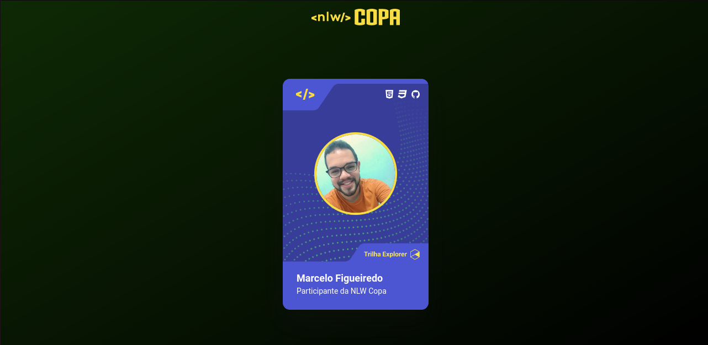
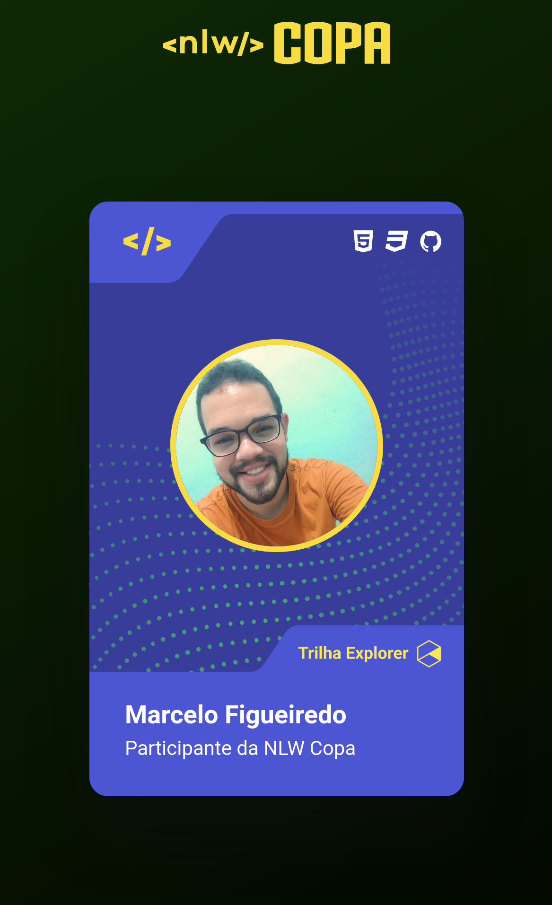

<h1 align="center"> Card da nlw copa </h1>

  <a href="#-tecnologias">Tecnologias</a>&nbsp;&nbsp;&nbsp;|&nbsp;&nbsp;&nbsp;
  <a href="#-projeto">Projeto</a>&nbsp;&nbsp;&nbsp;|&nbsp;&nbsp;&nbsp;
  <a href="#-layout">Layout</a>&nbsp;&nbsp;&nbsp;|&nbsp;&nbsp;&nbsp;
  <a href="#memo-licença">Licença</a>

  

 

<h1>Desktop:</h1>
  
 
<h1>Mobile:</h1>
  

## 🚀 Tecnologias

Esse projeto foi desenvolvido com as seguintes tecnologias:

- HTML e CSS
- JavaScript

## 💻 Projeto

O projeto card nlw foi desenvolvido com o intuito de criar sua própria figurinha da copa usando um layout do Figma como base, 
alem usar HTML e CSS adicionamos uma funcionalidade de trocar o fundo do cartão com um click no mesmo usando JavaScript. 

## 🔖 Layout

Você pode visualizar o layout do projeto através [DESSE LINK](https://www.figma.com/file/RJiY7XUiDAyuWNUXkIkZFt/NLW-Copa-Card-(Copy)?node-id=4%3A11). É necessário ter conta no [Figma](https://figma.com) para acessá-lo.

## :memo: Licença

Esse projeto está sob a licença MIT.

---
